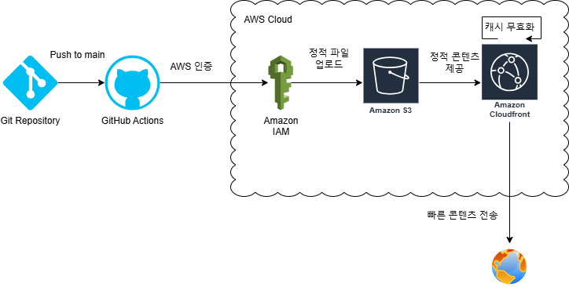
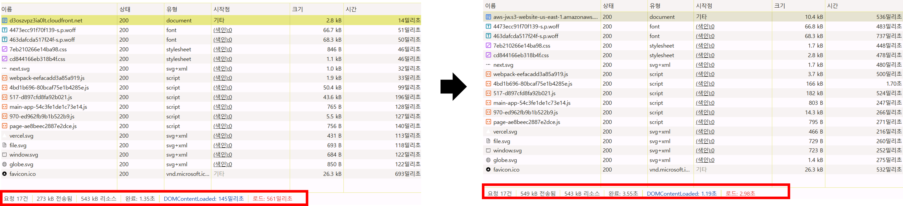
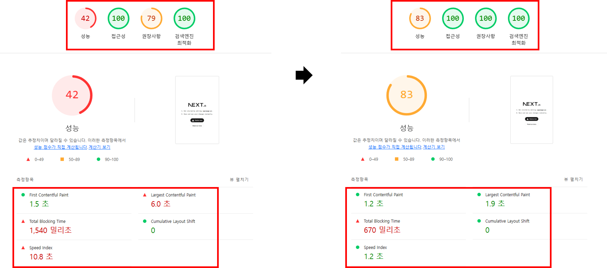

# 프론트엔드 배포 파이프라인


## 배포 인프라 구성
- `GitHub Actions`: CI/CD 파이프라인 실행
- `Amazon IAM`: AWS 리소스 접근 제어
- `Amazon S3`: 정적 웹사이트 호스팅
- `CloudFront`: CDN을 통한 전세계 콘텐츠 전송

## 배포 프로세스
1. main 브랜치에 코드가 push되면 GitHub Actions 워크플로우가 시작됩니다.
2. Node.js 환경에서 의존성을 설치하고 프로젝트를 빌드합니다.
3. AWS 인증 후 빌드된 산출물을 S3 버킷에 업로드합니다.
4. CloudFront를 통해 S3의 콘텐츠가 전세계 사용자에게 제공됩니다.
5. 배포 완료 시 CloudFront 캐시가 자동으로 갱신됩니다.

### GitHub Actions 워크플로우

1. 작업이 실행될 때 GitHub Actions UI에 표시
    ```
    name: Deploy Next.js to S3 and invalidate CloudFront # 작업이 실행될 때 GitHub Actions UI에 표시
    ```
2. main 브랜치에 푸시가 발생할 때 워크플로우가 실행
    ```
    on:
    push:
        branches:
        - main  # main 브랜치에 푸시가 발생할 때 워크플로우가 실행
    workflow_dispatch: # 사용자가 GitHub 웹 UI에서 수동으로 워크플로우 실행 가능
    ```

3. 저장소 체크아웃
    ```
    jobs:
    deploy:
        runs-on: ubuntu-latest # 작업을 실행할 환경으로 최신 버전의 Ubuntu 가상 머신을 사용
        
        steps:
        - name: Checkout repository # 저장소를 체크아웃합니다.
        uses: actions/checkout@v2
    ```
4. 의존성 설치
    ```
    - name: Install dependencies # Next.js 프로젝트에 필요한 의존성을 설치
        run: npm ci # npm install 대신 사용하며, package-lock.json 파일을 기반으로 의존성을 빠르게 설치
    ```
5. Next.js 프로젝트 빌드
    ```
    - name: Build # Next.js 프로젝트를 빌드
        run: npm run build #  이 과정에서 최적화된 정적 파일이 생성
    ```
6. AWS 자격 증명 설정
    ```
    - name: Configure AWS credentials # AWS CLI를 사용할 수 있도록 자격 증명을 설정
        uses: aws-actions/configure-aws-credentials@v1 # AWS의 GitHub Actions 플러그인을 사용
        with:
            aws-access-key-id: ${{ secrets.AWS_ACCESS_KEY_ID }}
            aws-secret-access-key: ${{ secrets.AWS_SECRET_ACCESS_KEY }}
            aws-region: ${{ secrets.AWS_REGION }}
    ```
7. Next.js의 빌드 결과물을 S3에 업로드
    ```
    - name: Deploy to S3 # Next.js의 빌드 결과물을 S3에 업로드
        run: | # Next.js 빌드 결과물이 위치한 디렉터리/업로드 대상 S3 버킷/S3에 남아 있는 불필요한 파일을 삭제
            aws s3 sync out/ s3://${{ secrets.S3_BUCKET_NAME }} --delete
    ```
8. 배포된 S3 파일과 관련된 CloudFront 캐시를 무효화
    ```
    - name: Invalidate CloudFront cache # 배포된 S3 파일과 관련된 CloudFront 캐시를 무효화하여 새로운 파일 즉시 반영
        run: | # 모든 파일의 캐시를 무효화
            aws cloudfront create-invalidation --distribution-id ${{ secrets.CLOUDFRONT_DISTRIBUTION_ID }} --paths "/*"
    ```

## 주요 링크

- S3 버킷 웹사이트 엔드포인트: http://aws-jw.s3-website-us-east-1.amazonaws.com/
- CloudFrount 배포 도메인 이름: https://d3oszvpz3ia0lt.cloudfront.net/

## 주요 개념

- `GitHub Actions과 CI/CD 도구`:
    - GitHub에서 제공하는 자동화 도구로, 코드 변경사항이 발생할 때마다 자동으로 빌드, 테스트, 배포를 수행합니다. 
    - CI(지속적 통합)와 CD(지속적 배포)를 통해 개발 프로세스를 자동화합니다.
- `S3와 스토리지`: 
    - Amazon S3는 확장 가능한 클라우드 스토리지 서비스입니다. 
    - 이 프로젝트에서는 빌드된 정적 웹사이트 파일들을 호스팅하는 용도로 사용됩니다.
- `CloudFront와 CDN`:  
    - CloudFront는 AWS의 CDN(콘텐츠 전송 네트워크) 서비스입니다. 
    - 전 세계 엣지 로케이션을 통해 S3에 저장된 콘텐츠를 사용자와 가까운 위치에서 빠르게 제공합니다.
- `캐시 무효화(Cache Invalidation)`: 
    - CloudFront는 성능 향상을 위해 콘텐츠를 캐싱합니다. 
    - 새로운 배포 시 이전 캐시를 삭제하여 사용자가 항상 최신 버전의 웹사이트를 볼 수 있도록 합니다.
- `Repository secret과 환경변수`: 
    - GitHub Repository에 안전하게 저장되는 민감한 설정 값들(AWS 인증 정보 등)입니다. 
    - 워크플로우 실행 시 이 값들을 환경변수로 사용하여 AWS 서비스에 접근합니다.


# CDN과 성능 최적화
## 도입 배경
- 글로벌 사용자의 웹 페이지 접근성 향상 필요
- 빠른 페이지 로딩을 통한 사용자 경험 개선 요구
- 서버 부하 분산 및 안정적인 서비스 제공 목적

## 성능 최적화 과정
### 1. AWS 인프라 구축
- S3 버킷 생성 및 정적 웹사이트 호스팅 설정
- CloudFront 배포 구성

### 2. CI/CD 파이프라인 구성
- GitHub Actions 워크플로우 설정
- 자동 배포 및 캐시 무효화 구현

## 성능 측정 결과 (크롬 개발자 도구)
### 방법 1) Network 탭

|측정 지표|CDN 도입 전|CDN 도입 후|개선율|
|:---|---:|:---:|:---:|
|전송된 데이터|549 kB|273 kB|50.3% ↓|
|페이지 완료 시간|3.55초|1.35초|62.0% ↓|
|DOMContentLoaded|1.19초|145ms|87.8% ↓|
|페이지 로드 시간|2.98초|561ms|81.2% ↓|

- 페이지 완료 시간
  - 모든 리소스가 다운로드되고 실행될 때까지의 전체 시간
- 페이지 로드 시간
  - window.onload 이벤트 발생 시점
  - 주요 리소스 로딩이 완료된 시점
- DOMContentLoaded
  - HTML 문서 파싱 완료 시점

### 방법 2) Lighthouse 탭

|측정 지표|CDN 도입 전|CDN 도입 후|개선율|
|:---|---:|:---:|:---:|
|First Contentful Paint|1.5초|1.2초|20% ↓|
|Largest Contentful Paint|6.0초|1.9초|68.3% ↓|
|Total Blocking Time|1,540ms|670ms|56.5% ↓|
|Speed Index간|10.8초|1.2초s|88.9% ↓|

- First Contentful Paint (FCP)
  - 페이지에서 첫 번째 콘텐츠가 표시되는 시점
- Largest Contentful Paint (LCP)
  - 뷰포트 내에서 가장 큰 콘텐츠가 표시되는 시점
- Total Blocking Time (TBT)
  - 메인 스레드가 차단된 총 시간
- Speed Index
  - 콘텐츠가 시각적으로 채워지는 속도

## 결과
### 성능 개선 효과
- 전송 데이터 50.3% 감소
- 초기 로딩 시간 87.8% 개선
- 전체 페이지 로드 시간 81.2% 단축
- Speed Index 88.9% 개선으로 시각적 로딩 속도 향상
- Largest Contentful Paint 68.3% 단축으로 핵심 콘텐츠 표시 시간 개선
- Total Blocking Time 56.5% 감소로 사용자 상호작용성 최적화
- First Contentful Paint 20% 단축으로 초기 로딩 개선

### 주요 이점
- 지연 시간 감소
  - 사용자와 가까운 엣지 로케이션에서 콘텐츠를 제공하므로 응답 시간이 크게 줄어듬
- 원본 서버(S3) 부하 감소
  - 반복적인 요청을 엣지 로케이션에서 처리하므로 S3의 부하가 줄어듬
- 사용자 경험 향상
  - 빠른 로딩 속도로 인해 전반적인 사용자 경험이 개선됨
